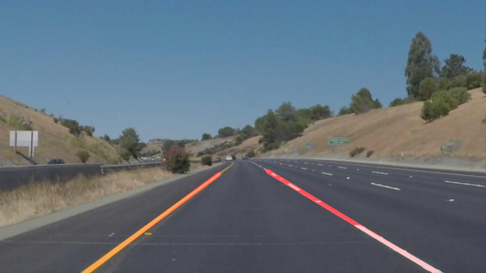
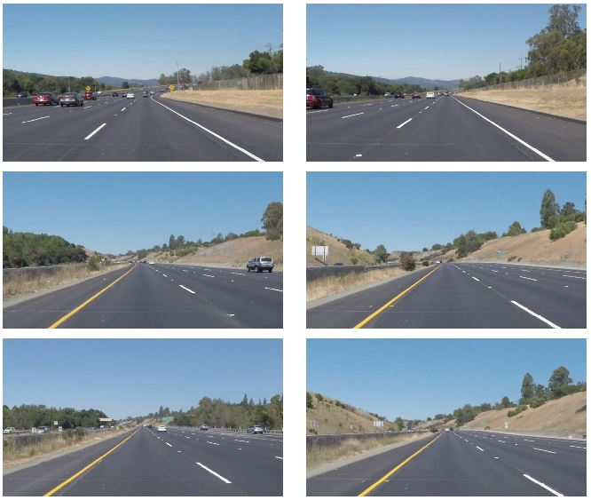
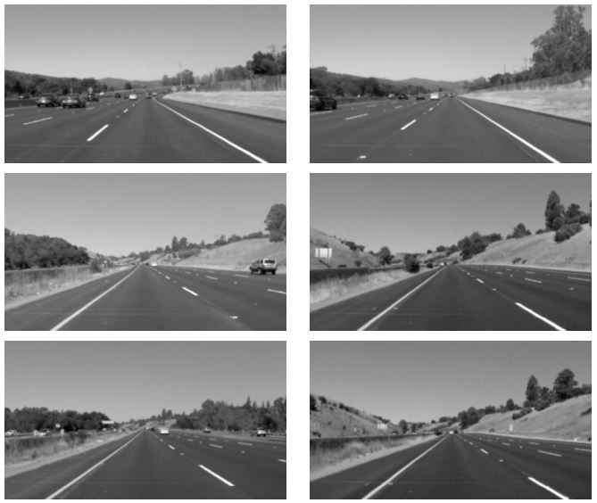
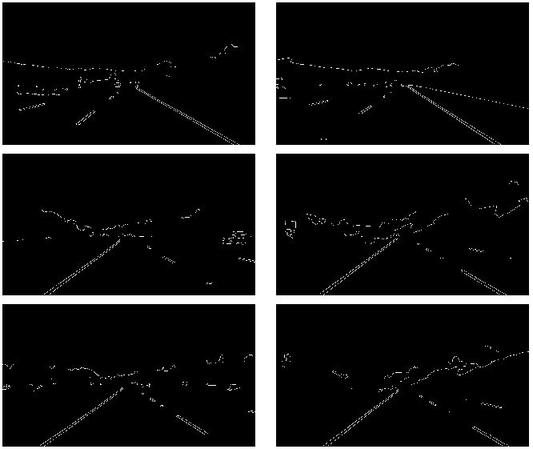
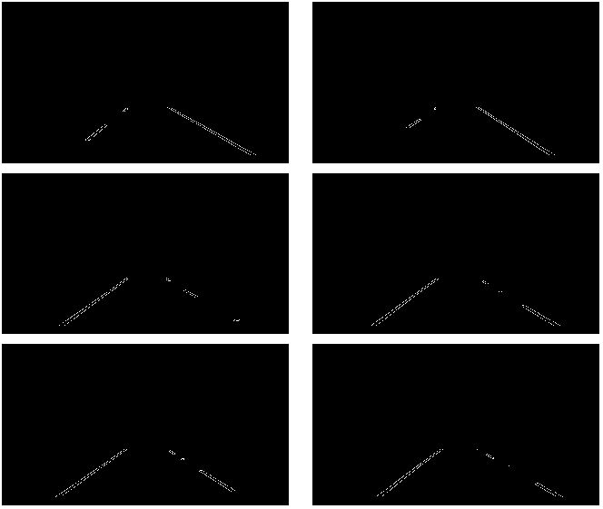
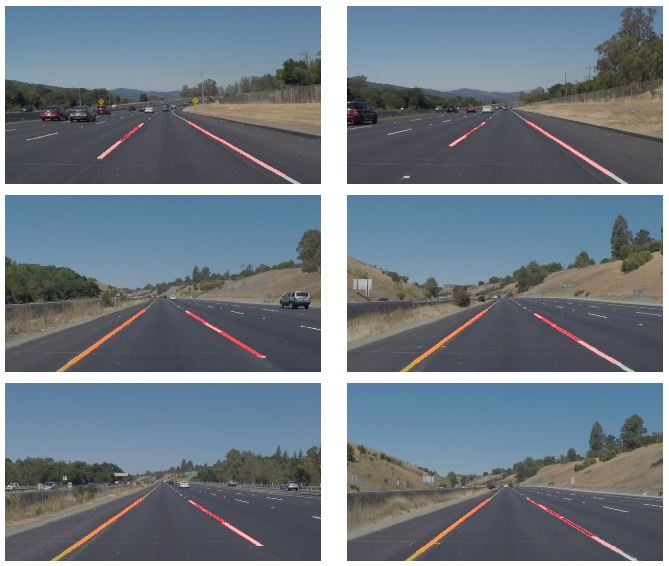
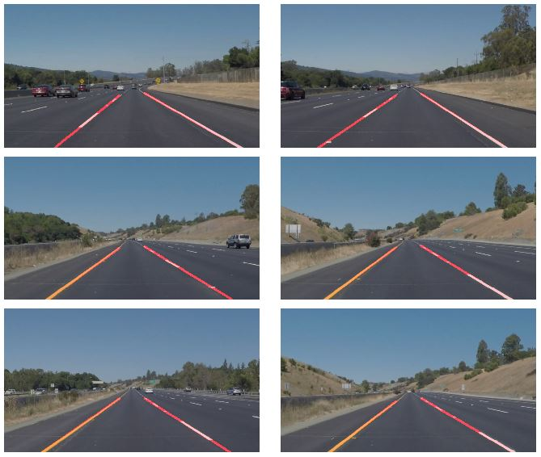

# Finding Lane Lines on the Road


## Overview
When we drive, we use our eyes to decide where to go. The lines on the road that show us where the lanes are act as our constant reference for where to steer the vehicle. Naturally, one of the first things we would like to do in developing a self-driving car is to automatically detect lane lines using an algorithm.

## Pipeline Description - Steps to Find Lane Lines
In this project I developed a simple pipeline that detects lane lines in images using Python and OpenCV. OpenCV means "Open-Source Computer Vision", which is a package that has many useful tools for analyzing images.

There are many useful OpenCV functions for detecting the lane line such as functions for color selection, region of interest selection, grayscaling, Gaussian smoothing, Canny Edge Detection and Hough Tranform line detection.

Some of the following will be used in this project:
- `cv2.inRange()` for color selection
- `cv2.fillPoly()` for regions selection
- `cv2.line()` to draw lines on an image given endpoints
- `cv2.addWeighted()` to coadd / overlay two images
- `cv2.cvtColor()` to grayscale or change color
- `cv2.imwrite()` to output images to file
- `cv2.bitwise_and()` to apply a mask to an image

If you are interested to learn more about these and many other excellent functions, check out the [OpenCV documentation](https://docs.opencv.org/2.4/)

**The pipeline developed consisted of five steps:**
1. Convert Images to Grayscale
2. Apply Smoothing - Gaussian Blur 
3. Apply Canny Edge Detector 
4. Apply Image Mask
5. Apply Hough Transform and Draw Lines on Image

Let's use the test images from [test_images](/test_images) dictionary to illustrate the pipeline process.

### Test Images
The images we will test the algorithm on are shown below. As you can see the color of lane lines can be either white or yellow and the line can be solid or dashed.




### Convert Images to Grayscale
The initial test images are stored as RGB colorspace arrays. This is a 3 channel representation where the values for each channel (Red, Green, Blue) can go from 0 (dark) to 255 (bright).
In this step transformation from RGB space is applied to convert the image into Grayscale. 

The conversion from a RGB image to gray is done with:

```python
gray = cv2.cvtColor(image, cv2.COLOR_RGB2GRAY)
```

### Smoothing - Gaussian Blur 
Smoothing, also called blurring, is a simple and frequently used image processing operation. In Gaussian Blur operation, the image is convolved with a Gaussian filter instead of the box filter. The Gaussian filter is a low-pass filter that removes the high-frequency components are reduced. In this way we can essentially suppress noise and spurious gradients in the image. 

The Smoothing operation is done with:

```python
blur_gray = cv2.GaussianBlur(gray, (kernel_size, kernel_size), 0)
```
The images after applying grayscale transform and Gaussian filter:


### Canny Edge Detector 
Canny Edge Detection is a popular edge detection algorithm. It was developed by John F. Canny in 1986. It is a multi-stage algorithm and we will go through each stages.

The edge detection using Canny algorithm is done with:
```python
edges = cv2.Canny(blur_gray, low_threshold, high_threshold)
```

The images after applying Canny Edge Detector:


### Image Mask
To focus as much as possible on the area of interest (lane lines), image mask was applied. This only keeps the region of the image defined by the polygon formed from `vertices`. The rest of the image is set to black.

The image mask is done with:
```python
masked_edges = region_of_interest(edges, vertices)
```
In the function definition of `region_of_interest` the OpenCV functions `cv2.fillPoly()` and `cv2.bitwise_and()` are used.

The images after applying Image Mask:


### Hough Transform
Hough Transform is a popular technique to detect any shape, if you can represent that shape in mathematical form. It can detect the shape even if it is broken or distorted a little bit. Here Hough Transform is used to extract lines from edge detected image. It uses the idea that a line in image space can be represented as a single point in parameter space, or Hough Space. 

The Hough Transform for line detection is done with:
```python
line_image = hough_lines(masked_edges, rho, theta, threshold, min_line_length, max_line_gap)
```
In the function definition of `hough_lines` the OpenCV functions `cv2.HoughLinesP()` and `draw_lines()` are used.
The last function is used to draw the detected lines from Hough Transform on the image.

The images after applying Hough Transform:


## Average and Extrapolate Line Segments
In the next step we took the line segments as the output of `cv2.HoughLinesP()` function average and extrapolate them in order to draw two solid lines representing left and right lane lines

For that we updated the function `draw_lines` defined above and defined a new function called `draw_lines_extend` to include these functionalities

The results of the new function is shown on the images below:


As expected the function plot one line for each lane line detected, starting from the bottom part of the image going up to the maximum region of interest.

## Potential Shortcomings with the Current Pipeline
- One potential shortcoming would be what would happen when there is/are no lane line on the road. The pipeline will simply not identify any line and therefore the algorithm will fail.
- Other potential issue could arise if the lighting conditions will change such as the brightness is too high and the lane lines will blur together with the rest of the road. 

Both of these shortcomings could be life threatening and therefore this pipeline serves the purpose of showing the simplest lane line detection algorithm possible.

## Possible Improvements to the Pipeline
There are many improvements that could be implemented for this pipeline. 
- For example, instead of working in RGB color space, the line detection could be improved by transforming the image from RGB color space to other color spaces such as HSV. This would allow to use one of the new H, S or V color channels and so improve the line detection in more challenging cases such as when the camera image exposed to too much light.
- One aspect that is not taken into account is the curvature of the road. In the current implementation, the lane lines are approximated with a straight line which doesn't correspond the reality. The more the region of interest is extended, the more inaccurate the results are provided one is driving on a curvy road. The improvement would be to calculate the curvature of the road and plot the lane lines as a curve with appropriate radius.
- One of the challenges in this implementation of the pipeline is to set up all parameters properly to ensure the algorithm works well on all camera images. Therefore a tool that would explore all possible parameter combinations and would rate each for its accuracy would be a very useful approach. Machine learning techniques is the way to perform this task and will be implemented in the near future.
